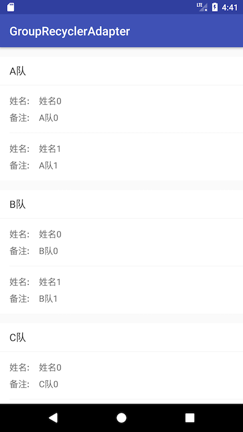

GroupRecyclerAdapter
====

GroupRecyclerAdapter是用于实现分组数据在RecyclerView中的展示，包括列表中的分割线处理。

[  ](https://bintray.com/msdx/maven/GroupRecyclerAdapter/_latestVersion)
<a href="http://www.methodscount.com/?lib=com.githang%3Agroup-recycler-adapter%3A0.1"></a>

# 运行效果


# 使用方法

## 添加依赖

```groovy
compile 'com.githang:group-recycler-adapter:0.2.2'
```

## Java代码

```java
    GroupRecyclerAdapter<Team, TeamViewHolder, MemberViewHolder> recyclerAdapter =
            new GroupRecyclerAdapter<Team, TeamViewHolder, MemberViewHolder>(teams) {
                @Override
                protected TeamViewHolder onCreateGroupViewHolder(ViewGroup parent) {
                    return new TeamViewHolder(layoutInflater.inflate(R.layout.item_team_title, parent, false));
                }

                @Override
                protected MemberViewHolder onCreateChildViewHolder(ViewGroup parent) {
                    return new MemberViewHolder(layoutInflater.inflate(R.layout.item_team_member, parent, false));
                }

                @Override
                protected void onBindGroupViewHolder(TeamViewHolder holder, int groupPosition) {
                    holder.update(getGroup(groupPosition));
                }

                @Override
                protected void onBindChildViewHolder(MemberViewHolder holder, int groupPosition, int childPosition) {
                    holder.update(getGroup(groupPosition).members.get(childPosition));
                }

                @Override
                protected int getChildCount(Team group) {
                    return group.members.size();
                }
            };
    recyclerView.setAdapter(recyclerAdapter);

    GroupItemDecoration decoration = new GroupItemDecoration(recyclerAdapter);
    decoration.setGroupDivider(ResourcesCompat.getDrawable(getResources(), R.drawable.divider_height_16_dp, null));
    decoration.setTitleDivider(ResourcesCompat.getDrawable(getResources(), R.drawable.divider_height_1_px, null));
    decoration.setChildDivider(ResourcesCompat.getDrawable(getResources(), R.drawable.divider_white_header, null));
    recyclerView.addItemDecoration(decoration);
```